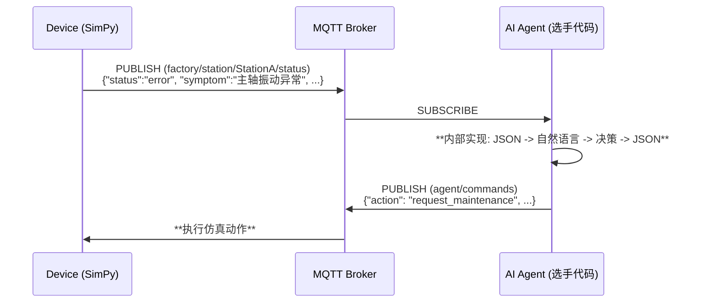
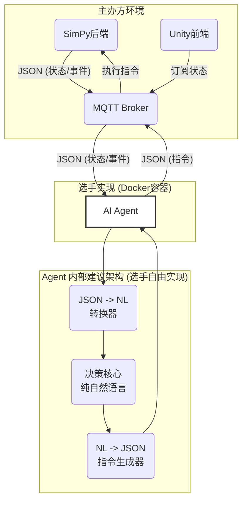

# AdventureX-SUPCON-Competition-PRD-v3.2

## 1. 项目概述

### 1.1 项目背景

**Natural Language Driven Factory** 是一个基于数字孪生技术的智能工厂仿真平台，专为黑客松比赛设计。参赛者需要开发 AI Agent 来优化工厂生产效率、处理故障、管理资源。

### 1.2 核心创新与价值

- **核心创新**: **用自然语言替代传统工业协议**。探索设备间基于语言的灵活协作新范式，验证"设备语言化通信 + AI 决策"的可行性。
- **技术挑战**: 实时智能决策、**模糊故障诊断**、**多约束动态优化**、**连锁反应预测**。
- **业务价值**: 工厂数字化转型、智能制造。
- **教育意义**: 工业 4.0 技术实践平台。
- **自然语言挑战**: 我们鼓励参赛者在自己的系统中**内部实现**自然语言作为桥梁，即：
    - `Translator Agent`: 将工厂的JSON状态翻译成自然语言，喂给决策核心 / 将决策核心的自然语言指令翻译回工厂可执行的JSON命令。
    - `Decision Maker`: 一个纯粹基于自然语言进行思考和决策的模型。

### 1.3 目标用户

| 用户类型   | 需求              | 使用场景            |
| ---------- | ----------------- | ------------------- |
| 参赛开发者 | AI Agent 开发工具 | 编写智能调度与诊断算法 |
| 评委专家   | 可视化评估平台    | 实时观察 Agent 表现 |
| 技术观众   | 演示和学习        | 了解智能制造技术    |

---

## 2. 工厂场景设计（精确定义）

### 2.1 工厂布局规格

#### 坐标系统

- **单位**: 米(m)
- **坐标系**: 笛卡尔坐标系，原点(0,0)为工厂左下角
- **工厂尺寸**: 100m × 40m

#### 设备精确位置和规格

| 设备 ID          | 类型       | 坐标(x,y) | 规格参数                             |
| ---------------- | ---------- | --------- | ------------------------------------ |
| **StationA**     | 组装工站   | (15, 20)  | 缓冲区:3 个位置, 处理时间:30-45 秒   |
| **StationB**     | 焊接工站   | (35, 20)  | 缓冲区:3 个位置, 处理时间:45-60 秒   |
| **StationC**     | 测试工站   | (55, 20)  | 缓冲区:3 个位置, 处理时间:20-30 秒   |
| **QualityCheck** | 质检站     | (75, 20)  | 缓冲区:2 个位置, 处理时间:15-25 秒   |
| **Conveyor_1**   | 传送带 A-B | (25, 20)  | 长度:10m, 速度:0.5m/s, 容量:3 个产品 |
| **Conveyor_2**   | 传送带 B-C | (45, 20)  | 长度:10m, 速度:0.5m/s, 容量:3 个产品 |
| **RawMaterial**  | 原料仓库   | (5, 20)   | 容量:无限                            |
| **Warehouse**    | 成品仓库   | (85, 20)  | 容量:无限                            |

#### AGV 规格（2 台）

| AGV_ID    | 初始位置 | 移动速度 | 载重     | 电池容量         |
| --------- | -------- | -------- | -------- | ---------------- |
| **AGV_1** | (10, 15) | 2.0 m/s  | 5 个产品 | 100%, 充电 30 秒 |
| **AGV_2** | (10, 25) | 2.0 m/s  | 5 个产品 | 100%, 充电 30 秒 |

**AGV 路径点**:

- P0: 原料仓库 (5, 20)
- P1: 工站 A 前 (12, 20)
- P2: 工站 A 后 (18, 20)
- P3: 工站 B 前 (32, 20)
- P4: 工站 B 后 (38, 20)
- P5: 工站 C 后 (58, 20)
- P6: 质检站前 (72, 20)
- P7: 质检站后 (78, 20)
- P8: 成品仓库 (85, 20)
- P9: 充电站 (10, 10)

### 2.2 搬运规则（混合模式）

#### 传送带职责（自动搬运）

- **Conveyor_1**: 工站 A → 工站 B（仅限 P1、P2 标准产品）
- **Conveyor_2**: 工站 B → 工站 C（仅限 P1、P2 标准产品）
- **触发条件**: 工站完成处理 + 传送带有空位 + 目标工站缓冲区有空位
- **搬运时间**: 距离/速度 = 10m/0.5m/s = 20 秒

#### AGV 职责（智能搬运）

1. **原料配送**: 原料仓库 → 工站 A（所有产品）
2. **特殊搬运**: 工站 B → 工站 A（仅 P3 二次装配）
3. **质检搬运**: 工站 C → 质检站（所有产品）
4. **成品输出**: 质检站 → 成品仓库（合格产品）
5. **返工搬运**: 质检站 → 对应工站（不合格产品）
6. **应急搬运**: 传送带故障时替代传送带功能

### 2.3 产品类型和精确工艺路径

#### 产品 P1（标准电子设备，60%）

```
原料仓库 → [AGV:20s] → 工站A[30-45s] → [传送带:20s] → 工站B[45-60s] → [传送带:20s] → 工站C[20-30s] → [AGV:15s] → 质检站[15-25s] → [AGV:10s] → 成品仓库
```

#### 产品 P2（高精度设备，30%）

```
原料仓库 → [AGV:20s] → 工站A[40-60s] → [传送带:20s] → 工站B[60-80s] → [传送带:20s] → 工站C[30-40s] → [AGV:15s] → 质检站[20-30s] → [AGV:10s] → 成品仓库
```

#### 产品 P3（定制设备，10%）

```
原料仓库 → [AGV:20s] → 工站A[35-50s] → [传送带:20s] → 工站B[50-70s] → [AGV:25s] → 工站A[20-30s] → [传送带:20s] → 工站C[25-35s] → [AGV:15s] → 质检站[20-30s] → [AGV:10s] → 成品仓库
```

### 2.4 订单生成机制

#### 订单参数

- **生成间隔**: 30-60 秒（均匀分布随机）
- **订单数量**: 1-5 件（权重: 1 件 40%, 2 件 30%, 3 件 20%, 4 件 7%, 5 件 3%）
- **产品分布**: P1(60%), P2(30%), P3(10%)
- **优先级分布**: 低(70%), 中(25%), 高(5%)

- **低优先级**: 订单创建时间 + 理论生产时间 × 3
- **中优先级**: 订单创建时间 + 理论生产时间 × 2
- **高优先级**: 订单创建时间 + 理论生产时间 × 1.5
本系统旨在挑战 Agent 的**模糊故障诊断**能力。我们为选手提供一份详尽的**《故障症状与诊断手册》**，但选手在比赛中只能观察到**症状**，需要自行**诊断**出根本原因并发出正确的指令。

### 2.5 故障系统 
#### 故障信息透明度原则
- **对选手公开**: 完整的《故障症状与诊断手册》，包含所有可能的`症状`、`根本原因`、`维修指令`和`基准维修时间`。
- **对选手隐藏**: 在具体某次故障事件中，`根本原因`是未知的，Agent必须通过`症状`和历史数据进行推断。

#### 故障症状与诊断手册 (示例)

| 症状 (Symptom) - *Agent可观察* | 可能的根本原因 (Root Cause) - *Agent需诊断* | 维修指令 (Action) - *Agent需发出* | 基准维修时间 | 错误诊断惩罚 |
| :--- | :--- | :--- | :--- | :--- |
| `"主轴振动异常"` | 1. **轴承磨损**: 长期高负荷运行导致。<br>2. **螺栓松动**: 正常损耗。 | 1. `request_maintenance(target, 'replace_bearing')`<br>2. `request_maintenance(target, 'tighten_bolts')` | `120s`<br>`30s` | 维修时间 +100% |
| `"加工精度下降"` | 1. **刀具钝化**: 达到使用寿命。<br>2. **校准偏移**: 软件参数错误。 | 1. `request_maintenance(target, 'replace_tool')`<br>2. `request_maintenance(target, 'recalibrate')` | `60s`<br>`90s` | 引发产品报废 |
| `"AGV路径阻塞"` | 1. **临时障碍物**: 其他AGV或人员占用路径点。<br>2. **定位模块失灵**: 自身硬件故障。 | 1. `reroute_agv(target, 'new_path')` 或 等待<br>2. `reboot_device(target)` | 自动恢复(30-120s)<br>`60s` | 任务超时 |
| `"AGV电量突降"` | 1. **电池老化**: 正常现象。<br>2. **高负载任务**: 搬运重物上坡。 | 1. `force_charge(target)`<br>2. `optimize_schedule()` (策略调整) | `30s`<br>N/A | 强制充电 |
| `"效率异常降低"` | 1. **软件过热**: 持续运行导致。<br>2. **润滑油不足**: 机械部件问题。 | 1. `reduce_frequency(target)`<br>2. `request_maintenance(target, 'add_lubricant')` | 自动恢复(300-600s)<br>`120s` | 生产周期延长 |

#### 质检与返工

- **质检失败率**: P1(6%), P2(8%), P3(12%)。
- **返工规则**:
  - 精度问题: 返回上一工站。
  - 装配问题: 返回工站 A。
- **返工次数**: 最多 2 次，超过则报废，计入成本。

### 2.6 动态与隐藏约束 (新增)

为防止选手针对固定参数进行硬编码，并考验 Agent 的**多约束决策**和**适应性**，系统引入了动态和隐藏约束。这些参数在**本地开发环境**和**云端评估环境**中会有所不同。

| 约束类型           | 描述                                                       | 示例                                            |
| ------------------ | ---------------------------------------------------------- | ----------------------------------------------- |
| **能源成本**       | 不同时间段或工站处理不同产品时，能源消耗和成本不同。         | 高峰时段电价是平时的1.5倍；StationC能耗较高。    |
| **材料兼容性**     | 某些工站可能无法处理特定材料，或处理时效率/次品率更高。      | StationB无法处理P3产品的特殊合金，强制执行会100%失败。 |
| **维护资源限制**   | 维修团队或备件在同一时间是有限的（例如，同时只能维修1台设备）。 | Agent需要对维修任务进行排程。                    |
| **供应链波动**     | 原材料供应可能随机中断，Agent需管理库存或寻找替代方案。      | 组件A缺货，持续120-300秒。                      |

### 2.7 KPI 指标（精确计算公式）

#### 生产效率指标

1. **订单完成率**: `(按时完成订单数 / 总订单数) × 100%`
2. **平均生产周期**: `Σ(订单完成时间 - 订单创建时间) / 完成订单数`
3. **设备利用率**: `(设备工作时间 / 总时间) × 100%`

#### 质量与成本指标

1. **一次通过率**: `(一次通过质检产品数 / 总产品数) × 100%`
2. **总生产成本**: `Σ(物料成本 + 能源成本 + 维修成本 + 报废成本)`
3. **AGV 利用率**: `(AGV运输时间 / (总时间 - 故障时间 - 充电时间)) × 100%`

---

## 3. 功能与架构（保姆级详解）

### 3.1 核心工作流：外部JSON接口，内部自然语言驱动

- **时间系统**: SimPy 离散事件仿真，时间单位为秒。
- **仿真速度**: 可调节，默认 1:1 实时，支持加速。
- **状态同步**: 每 100ms 更新一次状态，通过 MQTT 发布。仿真环境与选手Agent之间通过结构化的JSON消息进行通信，我们鼓励选手在自己的Agent内部构建自然语言处理能力，形成 `JSON -> NL -> JSON` 的完整决策链路。



### 3.2 MQTT 通信层（精确接口定义）

#### Topic 架构 (Agent视角)

| Topic | Agent权限 | 描述 | 消息格式 (Payload) |
| :--- | :--- | :--- | :--- |
| `factory/station/{id}/status` | **Subscribe** | 订阅所有工站的状态。**包含故障症状信息**。 | JSON (结构化) |
| `factory/resource/{id}/status`| **Subscribe** | 订阅所有AGV的状态 | JSON (结构化) |
| `factory/orders/new` | **Subscribe** | 接收新订单信息 | JSON (结构化) |
| `factory/kpi/update` | **Subscribe** | 订阅KPI更新 | JSON (结构化) |
| `factory/agent/commands`| **Publish**| **核心输出**: 发布选手Agent生成的结构化指令 | JSON (结构化) |

#### 消息日志与可复现性
系统会完整记录所有从`factory/*`收到的状态消息和选手发布的`agent/commands`消息，用于赛后评估和问题复现。选手**内部**可以自由实现`JSON->NL`的转换，但外部接口保持统一。

**状态消息示例 (`factory/station/{id}/status`)**:
```json
{
  "timestamp": 167762.0,
  "source_id": "StationB",
  "status": "error",
  "symptom": "主轴振动异常",
  "utilization": 0.95,
  "buffer_level": 2
}
```

### 3.4 选手核心任务
参赛者需要开发一个或多个**可以独立运行**的服务/应用，并将其打包成一个 Docker 镜像。该系统启动后，必须能够：
1.  **连接**到主办方提供的 MQTT Broker。
2.  **订阅**所有必要的 `factory/*` 状态主题。
3.  **解析**收到的 JSON 格式消息。
4.  **做出决策**。
5.  **发布**符合格式要求的 JSON 指令到 `agent/commands` 主题。

选手发往 `agent/commands` 的消息**必须**是以下格式的 JSON 字符串：

```json
{
  "command_id": "str (选手生成的唯一ID)",
  "agent_id": "str (选手队伍ID)",
  "action": "str (必须是支持的动作之一)",
  "target": "str (动作的目标设备ID)",
  "params": {
    "key": "value",
    "...": "..."
  }
}
```

#### 支持的指令 `action` 和所需 `params`

| Action | 描述 | Target | `params` 示例 |
| :--- | :--- | :--- | :--- |
| `request_maintenance` | 请求对设备进行维护 | 设备ID | `{"maintenance_type": "replace_bearing"}` |
| `move_agv` | 命令AGV移动到指定路径点 | AGV ID | `{"destination_id": "P9"}` |
| `reroute_order` | 重新规划订单路径 | 订单ID | `{"target_station_id": "StationC"}` |
| `adjust_priority` | 调整订单优先级 | 订单ID | `{"priority": "high"}` |
| `emergency_stop` | 紧急停止某个设备 | 设备ID | `{}` |

---

### 3.3 Unity 可视化前端 (详尽规格)

#### 3D 场景规格
- **工站模型**: 不同颜色立方体（A:蓝, B:绿, C:黄, Q:紫）。
- **AGV 模型**: 移动的圆柱体，顶部显示电量条和载货数。
- **传送带模型**: 带有移动动画的履带，显示产品方块。
- **产品表现**: 不同颜色的小方块（P1:红, P2:蓝, P3:绿）。

#### 状态同步精度
- **位置同步**: AGV 位置平滑插值动画，视觉上每秒60帧。
- **状态颜色**: 工站状态实时变化（绿:idle, 蓝:processing, **橙:symptom**, 红:maintenance）。
- **信息流可视化**: 以**对话气泡**形式实时显示设备状态消息中的`symptom`和选手发出的`command`。为了增强可视化效果，我们鼓励选手将内部的自然语言决策过程（可选）发布到一个专用的日志主题 `factory/agent/nl_logs` (纯文本)，前端将优先展示此主题内容。

#### 故障注入界面
- 评委和管理员可通过UI界面，选择设备和故障类型，实时注入故障，测试Agent的响应能力。

---

## 4. 技术与部署架构

### 4.1 系统架构图

```
┌─────────────────┐    MQTT    ┌─────────────────┐    MQTT   ┌─────────────────┐
│   Unity前端      │◄──────────►│   MQTT Broker  │◄──────────►│   SimPy后端     │
│ (WebGL/桌面版)   │            │  (Mosquitto)    │           │  (Python3.9+)   │
└─────────────────┘            └─────────────────┘           └─────────────────┘
                                        ▲
                                        │ MQTT
                                        ▼
      ┌─────────────────────────────────┬─────────────────────────────────┐
      │          AI Agent (选手)                                          │
      │ ┌─────────────────────────────┐ │ │     Instruction Parser      │ │
      │ │      核心决策逻辑             │ │ │         (解析自然语言)        │ │
      │ └─────────────────────────────┘ │ └─────────────────────────────┘ │
      └─────────────────────────────────┴─────────────────────────────────┘
```



### 4.2 部署架构
- **本地开发**: 提供 `docker-compose.yml` 一键启动本地仿真器、MQTT Broker 和 Agent 开发环境。
- **云端评估**: 在云服务器上隔离部署每个参赛队的 Agent 容器，并连接到统一的、**配置保密的**评估用仿真后端和指令解析器。

---

## 5. 验收标准

| 功能模块       | 验收标准                              | 测试方法        |
| -------------- | ------------------------------------- | --------------- |
| **SimPy 后端** | 支持所有设备类型，故障注入成功率 100% | 自动化测试脚本  |
| **MQTT 通信**  | 所有 Topic 正常收发，消息格式验证通过 | MQTT 客户端测试 |
| **Unity 前端** | 3D 显示正确，信息流可视化清晰         | 手动 UI 测试    |

---

## 6. 开发指南

### Step 1: 阅读文档
仔细阅读本 PRD 和《故障症状与诊断手册》，完全理解工厂的运作规则和 API 规范。

### Step 2: 设计你的系统
规划你的 `Decision Maker` 和（可选的）`Translator Agent` 的架构。选择你熟悉的技术栈（Python, Node.js, Java, etc.）。

### Step 3: 本地开发与测试
1.  **获取本地环境**: `git clone https://github.com/factory-agent/environment.git`
2.  **启动本地工厂**: `cd environment && docker-compose up -d`。这会启动一个与云端评估环境规则一致的本地工厂模拟器和 MQTT Broker。
3.  **连接与调试**: 编写你的 Agent 程序，连接到本地 MQTT (`localhost:1883`)，订阅和发布消息，进行功能调试。
4.  **使用调试工具**: 我们提供简单的脚本 (`tools/mqtt_monitor.py`, `tools/fault_injector.py`) 帮助你观察消息流和注入故障。

### Step 4: 实现你的系统
- **实现你的状态管理器**: 创建一个类来跟踪所有设备的状态、订单进度和历史事件。
- **实现你的诊断模块**: 当收到`language_message`时，调用此模块。根据《故障症状与诊断手册》，结合历史数据（例如，如果一个部件刚修好，它再次损坏的概率就较低），来推断最可能的根本原因。
- **实现你的决策规划器**: 根据诊断结果和全局状态，生成一个行动计划。例如，如果诊断为"轴承磨损"，且有高优先级订单正在该设备处理，你的决策可能是"先降频运行完成订单，再进行维修"。 
- **实现你的指令生成器**: 将你的行动计划转换为清晰、无歧义的自然语言指令。参考《标准指令集》以确保解析器能理解。
- **实现你的Translator Agent**: 将你的自然语言指令转换为工厂可执行的JSON命令。
- **实现你的Decision Maker**: 一个纯粹基于自然语言进行思考和决策的模型。

### Step 5: 打包与提交
1.  **创建 Dockerfile**: 为你的整个系统编写一个 Dockerfile。确保 `CMD` 或 `ENTRYPOINT` 可以启动你的所有服务。
2.  **构建镜像**: `docker build -t your-team-agent:latest .`
3.  **提交镜像**: 将你的 Docker 镜像推送到指定的镜像仓库。

---

## 7. 比赛评分（精确标准）

### 7.1 评分公式

**生产效率得分 (40%)**:
`效率得分 = (订单完成率 × 0.5 + 1 / 平均生产周期 × 0.5) × 40` (与基线对比归一化)

**成本控制得分 (30%)**:
`成本分 = (1 / 总生产成本) × 30` (与基线对比归一化)

**鲁棒性得分 (30%)**:
`鲁棒性分 = (诊断准确率 × 0.6 + 1 / 平均恢复时间 × 0.4) × 30`

### 7.2 测试场景
- **标准测试 (2h)**: 正常生产 → 设备故障 → AGV故障 → 原料短缺。
- **压力测试 (30min)**: 高频订单 + 多重并发故障。
- **现场演示 (15min)**: 评委实时注入**手册之外**的未知故障，考验Agent的泛化能力。 