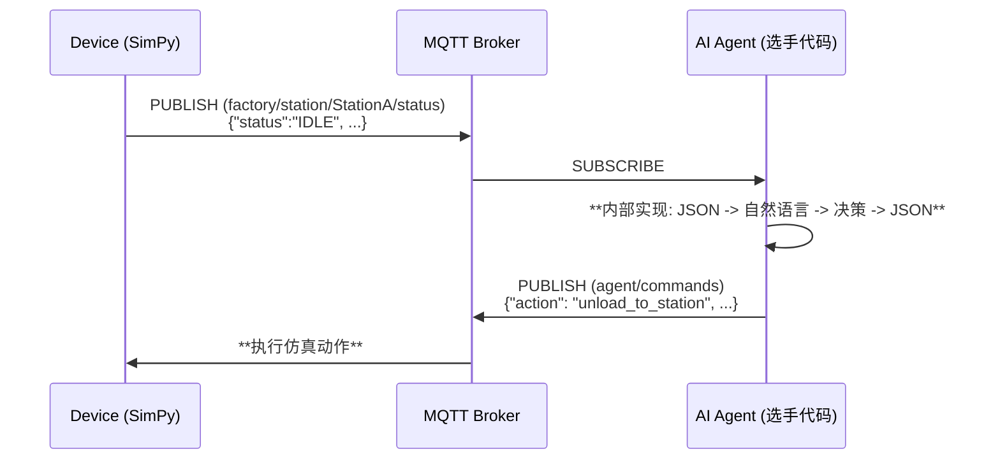
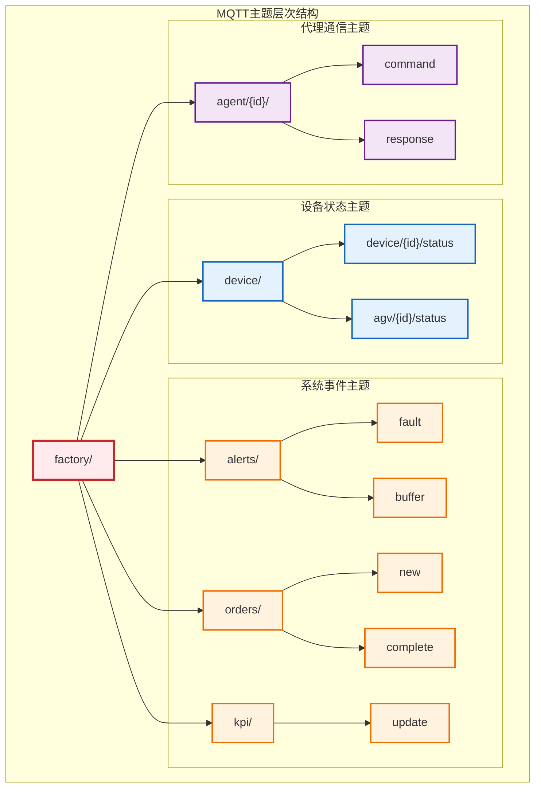
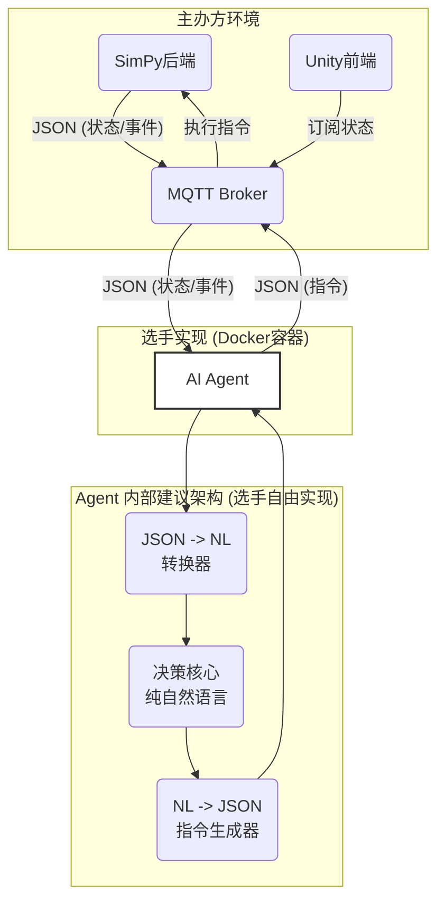

# AdventureX-SUPCON-Competition-PRD-v3.4

## 1. 项目概述

### 1.1 项目背景

**Natural Language Driven Factory**（NLDF） 是一个基于数字孪生技术的智能工厂仿真平台，专为黑客松比赛设计。参赛者需要开发 AI Agent 来优化工厂生产效率、处理故障、管理资源。目前版本3.4，开发目标为工业版的 小动物餐吧(party club) or 胡闹厨房(Overcooked)。

### 1.2 核心创新与价值

- **核心创新**: **用自然语言替代传统工业协议**。探索设备间基于语言的灵活协作新范式，验证"设备语言化通信 + AI 决策"的可行性。
- **技术挑战**: 实时智能决策、**模糊故障诊断**、**多约束动态优化**、**连锁反应预测**。
- **业务价值**: 工厂数字化转型、智能制造。
- **教育意义**: 工业 4.0 技术实践平台。
- **自然语言挑战**: 我们要求参赛者在自己的系统中**内部实现**自然语言作为桥梁，即：
    - `Translator Agent`: 将工厂的JSON状态翻译成自然语言，喂给决策核心 / 将决策核心的自然语言指令翻译回工厂可执行的JSON命令。
    - `Decision Maker`: 一个纯粹基于自然语言进行思考和决策的模型。
    - 将过程中的自然语言指令通过`NL_LOGS_TOPIC = "NLDF/{line}/agent/nl_logs"`广播用于前端可视化。

### 1.3 目标用户

| 用户类型   | 需求              | 使用场景            |
| ---------- | ----------------- | ------------------- |
| 参赛开发者 | AI Agent 开发工具 | 编写智能调度与诊断算法 |
| 评委专家   | 可视化评估平台    | 实时观察 Agent 表现 |
| 技术观众   | 演示和学习        | 了解智能制造技术    |

---

## 2. 工厂场景设计 (以yml文件定义为准)

### 2.1 工厂单个产线布局规格 （后续版本将支持3条产线）

#### 假想坐标系统（当前工厂以时间驱动，并不依靠物理距离和速度，可忽略）

- **单位**: 米(m)
- **坐标系**: 笛卡尔坐标系，原点(0,0)为工厂左下角
- **工厂尺寸**: 100m × 40m 

#### 设备精确位置和规格

| 设备 ID          | 类型       | 坐标(x,y) | 规格参数                             |
| ---------------- | ---------- | --------- | ------------------------------------ |
| **StationA**     | 组装工站   | (15, 20)  | 缓冲区:3 个位置, 处理时间:30-45 秒   |
| **StationB**     | 焊接工站   | (35, 20)  | 缓冲区:3 个位置, 处理时间:45-60 秒   |
| **StationC**     | 测试工站   | (55, 20)  | 缓冲区:3 个位置, 处理时间:20-30 秒   |
| **QualityCheck** | 质检站     | (75, 20)  | 缓冲区:2 个位置, 处理时间:15-25 秒   |
| **Conveyor_AB**   | 传送带 A-B | (25, 20)  | 长度:10m, 速度:0.5m/s, 容量:3 个产品 |
| **Conveyor_BC**   | 传送带 B-C | (45, 20)  | 长度:10m, 速度:0.5m/s, 容量:3 个产品 |
| **Conveyor_CQ**   | 传送带 C-Q | (65, 20)  | 长度:10m, 速度:0.5m/s, 容量:3 个产品 |
| **RawMaterial**  | 原料仓库   | (5, 20)   | 容量:无限                            |
| **Warehouse**    | 成品仓库   | (85, 20)  | 容量:无限                            |

#### 工厂布局示意图

```mermaid
graph TD
    subgraph "上方区域 (y=25)"
        AGV2("AGV_2")
        Charge2("充电站 2<br/>(10, 30)")
        AGV2 --- Charge2
    end
    subgraph "核心产线 (y=20)"
        direction LR
        Raw("原料仓库<br/>(5, 20)") --> |"AGV_1 (原料)"| SA["工站 A<br/>(15, 20)"]
        SA -- "传送带 1" --> SB["工站 B<br/>(35, 20)"]
        SB -- "传送带 2" --> SC["工站 C<br/>(55, 20)"]
        SC -- "传送带 3" --> SQ["质检站<br/>(75, 20)"]
        SQ --> |"AGV_1 (成品)"| WH("成品仓库<br/>(85, 20)")
        SC -.-> |"AGV_2 (P3特殊路径)"| SB
    end
    subgraph "下方区域 (y=15)"
        AGV1("AGV_1")
        Charge1("充电站 1<br/>(10, 10)")
        AGV1 --- Charge1
    end
    style AGV1 fill:#D5F5E3,stroke:#58D68D,stroke-width:2px
    style AGV2 fill:#D5F5E3,stroke:#58D68D,stroke-width:2px
    style SA fill:#D6EAF8,stroke:#5DADE2,stroke-width:2px
    style SB fill:#D6EAF8,stroke:#5DADE2,stroke-width:2px
    style SC fill:#D6EAF8,stroke:#5DADE2,stroke-width:2px
    style SQ fill:#D6EAF8,stroke:#5DADE2,stroke-width:2px
    style Raw fill:#FEF9E7,stroke:#F4D03F,stroke-width:2px
    style WH fill:#FEF9E7,stroke:#F4D03F,stroke-width:2px
    style Charge1 fill:#FADBD8,stroke:#E74C3C,stroke-width:2px
    style Charge2 fill:#FADBD8,stroke:#E74C3C,stroke-width:2px
```



#### AGV 分区操作与碰撞规避

为从根本上避免 AGV 碰撞并简化调度，工厂采用**物理分区**策略。两台 AGV 在产线的上下方拥有完全独立的轨道和工作区域，它们的路径在任何时候都不会交叉。

- **下方 AGV (AGV_1)**: 负责产线南侧（y < 20）的所有运输任务。
- **上方 AGV (AGV_2)**: 负责产线北侧（y > 20）的所有运输任务。

这种设计确保了 AGV 之间无需复杂的通信或动态避让，极大提高了系统的鲁棒性和效率。

#### AGV 规格（2 台）

| AGV_ID    | 初始位置  | 载重     | 电池容量与充电机制           |
| --------- | --------| -------- | ---------------------------- |
| **AGV_1** | P10 (10, 10)  | 2 个产品 | 100%, 充电点P10, 30秒充满 |
| **AGV_2** | P10 (10, 30) | 2 个产品 | 100%, 充电点P10, 30秒充满 |

**AGV 路径点**:
AGV_1:
- P0: [5, 15] # raw material warehouse
- P1: [12, 15] # StationA
- P2: [25, 15] # Conveyor_AB
- P3: [32, 15] # StationB
- P4: [45, 15] # Conveyor_BC
- P5: [52, 15] # StationC 
- P6: [65, 10] # Conveyor_CQ_lower
- P7: [72, 15] # QualityChecker
- P8: [80, 15] # QualityChecker_output
- P9: [95, 15] # Warehouse
- P10: [10, 10] # Charging Area

AGV_2:
- P0: [5, 25]
- P1: [12, 25]
- P2: [25, 25]
- P3: [32, 25]
- P4: [45, 25]
- P5: [52, 25]
- P6: [65, 25]
- P7: [72, 25]
- P8: [80, 25]
- P9: [95, 25]
- P10: [10, 30]

### 2.2 AGV 充电机制设计

为增强比赛的策略性和挑战性，AGV 引入了完整的电量管理机制，选手需要合理规划 AGV 使用策略以避免因电量不足导致的任务中断和 KPI 惩罚。

#### 电量消耗模型

| 操作类型 | 电量消耗 | 备注 |
| -------- | -------- | ---- |
| **移动** | 0.1%/米 | 根据实际移动距离（以及移动速度）计算 |
| **装载/卸载** | 0.5%/次 | 每次装卸操作固定消耗 |
| **等待/闲置** | 0%/秒 | 静止状态无电量消耗 |

#### 充电机制

- **充电速度**: 3.33%/秒（30秒充满）
- **充电点位置**: AGV_1 充电点 (10,10)，AGV_2 充电点 (10,30)
- **充电状态**: 充电期间 AGV 无法执行其他任务，设备状态为 MAINTENANCE

#### 低电量管理

| 电量阈值 | 行为规则 | KPI 影响 |
| -------- | -------- | -------- |
| **≤5%** | 强制返航充电，中断当前任务 | 任务中断次数 +1，效率扣分 |
| **5%-20%** | 可正常操作，但建议主动充电 | 无惩罚 |
| **>20%** | 正常工作状态 | 无影响 |

#### 充电策略

1. **被动充电（KPI 惩罚）**
   - 电量 ≤5% 时自动触发
   - 中断当前任务，强制返航
   - 计入"任务中断次数"，影响效率评分
   - 如载有货物，额外记录"低电量载货中断"

2. **主动充电（推荐策略）**
   - 选手可随时调度 AGV 前往充电
   - 无 KPI 惩罚
   - 通过合理的充电时机规划避免被动充电

#### 告警与监控

- **MQTT 告警**: 电量首次降至 5% 以下时推送告警消息
- **状态同步**: AGV 电量、充电状态实时通过 MQTT 广播
- **预估功能**: AGV 会预估当前电量是否足够完成指定任务

#### 游戏机制设计目标

- **策略规划**: 选手需提前规划 AGV 充电时机，避免生产高峰期电量不足
- **资源管理**: 2 台 AGV 需协调使用，一台充电时另一台承担更多任务
- **风险权衡**: 主动充电损失短期效率，但避免被动充电的更大惩罚

### 2.3 搬运规则（混合模式）

#### 传送带buffer（自动搬运与AGV手动搬运）

- **Conveyor_AB**: 工站 A → 工站 B（仅限 P1、P2 P3标准产品）
- **Conveyor_BC**: 工站 B → 工站 C（仅限 P1、P2 P3标准产品）
- **Conveyor_CQ-main**: 工站 C → 质检站（仅限 P1、P2 P3标准产品）
- **Conveyor_CQ-lower**: P3产品特殊buffer for 下方AGV
- **Conveyor_CQ-upper**: P3产品特殊buffer for 上方AGV

- **触发条件**: 工站完成处理 + 传送带有空位/目标工站缓冲区有空位
- **搬运时间**: Hardcoded in `transfer_time` yml file

#### AGV 职责（智能搬运）

1. **原料配送**: 原料仓库 → 工站 A（所有产品）
2. **特殊搬运**: 工站 C → 工站 B（仅 P3 二次装配）
4. **成品输出**: 质检站 → 成品仓库（合格产品）
5. **返工搬运**: 质检站 → 前一工站(StationC)（返工产品）
6. **应急搬运**: 传送带故障时替代传送带功能

### 2.4 产品类型和精确工艺路径（以yml文件为准）

#### 产品 P1（标准消费电子设备，60%）

_代表：基础 PCB 组件、简单电子模块、标准化产品_

```
原料仓库 → [AGV:20s] → 工站A[初级加工:30-45s] → [传送带:20s] → 工站B[精密加工:45-60s] → [传送带:20s] → 工站C[综合测试:20-30s] → [传送带:20s] → 质检站[最终检验:15-25s] → [AGV:10s] → 成品仓库
```

#### 产品 P2（高精度设备，30%）
**总周期时间**: 155-195 秒

#### 产品 P2（高精度工控设备，30%）

_代表：工业控制板、精密传感器、高可靠性模块_

```
原料仓库 → [AGV:20s] → 工站A[初级加工:40-60s] → [传送带:20s] → 工站B[精密加工:60-80s] → [传送带:20s] → 工站C[综合测试:30-40s] → [传送带:20s] → 质检站[最终检验:20-30s] → [AGV:10s] → 成品仓库
```

**总周期时间**: 200-240 秒

#### 产品 P3（复杂定制设备，10%）

_代表：高复杂度产品、需要特殊工艺路径的定制产品_

```
原料仓库 → [AGV:20s] → 工站A[初级加工:35-50s] → [传送带:20s] → 工站B[精密加工:50-70s] → [传送带:20s] → 工站C[初测:25-35s] → [暂存upper/lower buffer] → [AGV:25s] → 工站B[二次加工:40-60s] → [传送带:20s] → 工站C[全面测试:35-50s] → [传送带:20s] → 质检站[深度检验:25-35s] → [AGV:10s] → 成品仓库
```

**总周期时间**: 290-365 秒

### 2.5 订单生成机制(以yml文件为准)

#### 订单参数

- **生成间隔**: 30-60 秒（均匀分布随机）
- **订单数量**: 1-5 件（权重: 1 件 40%, 2 件 30%, 3 件 20%, 4 件 7%, 5 件 3%）
- **产品分布**: P1(60%), P2(30%), P3(10%)
- **优先级分布**: 低(70%), 中(25%), 高(5%)

- **低优先级**: 订单创建时间 + 理论生产时间 × 3
- **中优先级**: 订单创建时间 + 理论生产时间 × 2
- **高优先级**: 订单创建时间 + 理论生产时间 × 1.5

### 2.6 故障系统

#### 当前故障警报
- Station(Conveyor) buffer full triggers a soft fault warning.
- AGV battery low triggers a soft fault warning.

#### 当前生成故障
- Station Fault
- Conveyor Fault
- AGV Fault
直接触发中断，让device状态设置为Fault，无法进行操作！给定duration time，故障结束，设备状态自动恢复。后续应为AGV提供Repair功能，AGV可以主动请求维修，维修时间不计入KPI。

#### 故障信息透明度原则(Deprecated)
- **对选手公开**: 完整的《故障症状与诊断手册》，包含所有可能的`症状`、`根本原因`、`维修指令`和`基准维修时间`。
- **对选手隐藏**: 在具体某次故障事件中，`根本原因`是未知的，Agent必须通过`症状`和历史数据进行推断。
- 当前版本不支持故障信息透明度原则，无症状和原因分析系统，无需进行诊断

#### 故障症状与诊断手册 （示例可选用于后续拓展）(Deprecated)

| 症状 (Symptom) - *Agent可观察* | 可能的根本原因 (Root Cause) - *Agent需诊断* | 维修指令 (Action) - *Agent需发出* | 基准维修时间 | 错误诊断惩罚 |
| :--- | :--- | :--- | :--- | :--- |
| `"主轴振动异常"` | 1. **轴承磨损**: 长期高负荷运行导致。<br>2. **螺栓松动**: 正常损耗。 | 1. `request_maintenance(target, 'replace_bearing')`<br>2. `request_maintenance(target, 'tighten_bolts')` | `120s`<br>`30s` | 维修时间 +100% |
| `"加工精度下降"` | 1. **刀具钝化**: 达到使用寿命。<br>2. **校准偏移**: 软件参数错误。 | 1. `request_maintenance(target, 'replace_tool')`<br>2. `request_maintenance(target, 'recalibrate')` | `60s`<br>`90s` | 引发产品报废 |
| `"AGV路径阻塞"` | 1. **临时障碍物**: 其他AGV或人员占用路径点。<br>2. **定位模块失灵**: 自身硬件故障。 | 1. `reroute_agv(target, 'new_path')` 或 等待<br>2. `reboot_device(target)` | 自动恢复(30-120s)<br>`60s` | 任务超时 |
| `"AGV电量突降"` | 1. **电池老化**: 正常现象。<br>2. **高负载任务**: 搬运重物上坡。 | 1. `force_charge(target)`<br>2. `optimize_schedule()` (策略调整) | `30s`<br>N/A | 强制充电 |
| `"效率异常降低"` | 1. **软件过热**: 持续运行导致。<br>2. **润滑油不足**: 机械部件问题。 | 1. `reduce_frequency(target)`<br>2. `request_maintenance(target, 'add_lubricant')` | 自动恢复(300-600s)<br>`120s` | 生产周期延长 |

#### 质检与返工

- **质检失败率**: P1(6%), P2(8%), P3(12%)。
- **返工规则**: 返回上一工站(StationC)。
- **返工次数**: 最多 1 次，超过则报废，计入成本。

### 2.7 动态与隐藏约束 (可选)(Deprecated)

为防止选手针对固定参数进行硬编码，并考验 Agent 的**多约束决策**和**适应性**，系统引入了动态和隐藏约束。这些参数在**本地开发环境**和**云端评估环境**中会有所不同。

| 约束类型           | 描述                                                       | 示例                                            |
| ------------------ | ---------------------------------------------------------- | ----------------------------------------------- |
| **能源成本**       | 不同时间段或工站处理不同产品时，能源消耗和成本不同。         | 高峰时段电价是平时的1.5倍；StationC能耗较高。    |
| **材料兼容性**     | 某些工站可能无法处理特定材料，或处理时效率/次品率更高。      | StationB无法处理P3产品的特殊合金，强制执行会100%失败。 |
| **维护资源限制**   | 维修团队或备件在同一时间是有限的（例如，同时只能维修1台设备）。 | Agent需要对维修任务进行排程。                    |
| **供应链波动**     | 原材料供应可能随机中断，Agent需管理库存或寻找替代方案。      | 组件A缺货，持续120-300秒。                      |

### 2.8 KPI 指标（精确计算公式）(New)
 
#### 生产效率指标
 
1. **订单完成率**: `(按时完成订单数 / 总订单数) × 100%`
2. **加权平均生产周期**: `所有已完成产品的实际生产时间 与 其各自理论生产时间的比率之和 / 已完成产品总数`
3. **设备利用率**: `(设备工作时间 / 总时间) × 100%`
 
#### 质量与成本指标
 
1. **一次通过率**: `(一次通过质检产品数 / 总产品数) × 100%`
2. **总生产成本**: `Σ(物料成本 + 能源成本 + 维修成本 + 报废成本)`
 
#### AGV 操控效率指标
 
1. **充电策略效率**: `(主动充电次数 / (主动充电次数 + 被动充电次数)) × 100%`
2. **AGV 能效比**: `(完成任务数 / 总充电时间)`
3. **AGV 利用率**: `(AGV运输时间 / (总时间 - 故障时间 - 充电时间)) × 100%`
 
---

## 3. 功能与架构

### 3.1 核心工作流：外部JSON接口，内部自然语言驱动

- **时间系统**: SimPy 离散事件仿真，时间单位为秒。
- **仿真速度**: 可调节，当前默认比例 1:1，后续将支持比例修改。
- **状态同步**: 完全由事件驱动，设备状态发生改变时通过 MQTT 发布设备信息。
- 仿真环境与选手Agent之间通过结构化的JSON消息进行通信，我们鼓励选手在自己的Agent内部构建自然语言处理能力，形成 `JSON -> NL -> JSON` 的完整决策链路。



### 3.2 MQTT 通信层（精确接口定义）

#### 主题架构图
 

 
---

#### Topic 架构 (Agent视角)

| Topic | Agent权限 | 描述 | 消息格式 (Payload) |
| :--- | :--- | :--- | :--- |
| `factory/station/{id}/status` | **Subscribe** | 订阅所有工站的状态。**包含故障症状信息**。 | JSON (结构化) |
| `factory/resource/{id}/status`| **Subscribe** | 订阅所有AGV的状态 | JSON (结构化) |
| `factory/orders/new` | **Subscribe** | 接收新订单信息 | JSON (结构化) |
| `factory/kpi/update` | **Subscribe** | 订阅KPI更新 | JSON (结构化) |
| `factory/agent/commands`| **Publish**| **核心输出**: 发布选手Agent生成的结构化指令 | JSON (结构化) |

#### 消息日志与可复现性
选手须记录所有从`factory/*`收到的状态消息和自己发布的`agent/commands`消息，以及过程中的所有自然语言决策，用于赛后评估和问题复现。选手**内部**可以自由实现`JSON->NL`的转换，但外部接口保持统一。

### 3.4 选手核心任务
参赛者需要开发一个或多个**可以独立运行**的服务/应用，并将其打包成一个 Docker 镜像。该系统启动后，必须能够：
1.  **连接**到主办方提供的 MQTT Broker。
2.  **订阅**所有必要的 `factory/*` 状态主题。
3.  **解析**收到的 JSON 格式消息。
4.  **做出决策**。
5.  **发布**符合格式要求的 JSON 指令到 `agent/commands` 主题。

选手发往 `agent/commands` 的消息**必须**是以下格式的 JSON 字符串：

```json
{
  "command_id": "str (选手可选参数，用于记录决策过程)",
  "agent_id": "str (暂时deprecated)",
  "action": "str (必须是支持的动作之一)",
  "target": "str (动作的目标设备ID，可选)",
  "params": {
    "key": "value",
    "...": "..."
  }
}
```

#### 支持的指令 `action` 和所需 `params`

| Action | 描述 | Target | `params` 示例 |
| :--- | :--- | :--- | :--- |
| `move` | 命令AGV移动到指定路径点 | AGV ID | `{"destination_id": "P9"}` |
| `charge` | 命令AGV主动充电 | AGV ID | `{}` |
| `unload` | 命令AGV卸载产品到指定工站 | AGV ID | `{"target_station_id": "StationC"}` |
| `load` | 命令AGV从指定工站装载产品 | AGV ID | `{"source_station_id": "StationC"}` |
| `repair` | 命令AGV前往帮助维修(未实现) | AGV ID | `{"target_station_id": "StationC"}` |

---

### 3.3 Unity 可视化前端

#### 3D 场景规格
- **工站模型**: 不同颜色立方体（A:蓝, B:绿, C:黄, Q:紫）。
- **AGV 模型**: 移动的圆柱体，顶部显示电量条和载货数。
- **传送带模型**: 带有移动动画的履带，显示产品方块。
- **产品表现**: 不同颜色的小方块（P1:红, P2:蓝, P3:绿）。

#### 状态同步精度
- **位置同步**: AGV 位置平滑插值动画，视觉上每秒60帧。
- **状态颜色**: 工站状态实时变化（绿:idle, 蓝:processing, **橙:symptom**, 红:maintenance）。
- **信息流可视化**: 以**对话气泡**形式实时显示设备状态消息和选手发出的`command`。为了增强可视化效果，选手须将内部的自然语言决策过程发布到一个专用的日志主题 `factory/agent/nl_logs` (纯文本)，前端将优先展示此主题内容。

#### 故障注入界面（Deprecated）
- 评委和管理员可通过UI界面，选择设备和故障类型，实时注入故障，测试Agent的响应能力。

---

## 4. 技术与部署架构

### 4.1 系统架构图

```
┌─────────────────┐    MQTT    ┌─────────────────┐    MQTT   ┌─────────────────┐
│   Unity前端      │◄──────────►│   MQTT Broker  │◄──────────►│   SimPy后端     │
│ (WebGL/桌面版)   │            │  (Mosquitto)    │           │  (Python3.9+)   │
└─────────────────┘            └─────────────────┘           └─────────────────┘
                                        ▲
                                        │ MQTT
                                        ▼
      ┌─────────────────────────────────┬─────────────────────────────────┐
      │          AI Agent (选手)                                          │
      │ ┌─────────────────────────────┐ │ │     Instruction Parser      │ │
      │ │      核心决策逻辑             │ │ │         (解析自然语言)        │ │
      │ └─────────────────────────────┘ │ └─────────────────────────────┘ │
      └─────────────────────────────────┴─────────────────────────────────┘
```



### 4.2 部署架构
- **本地开发**: 提供 `docker-compose.yml` 一键启动本地仿真器、MQTT Broker 和 Agent 开发环境。
- **云端评估**: 在云服务器上隔离部署每个参赛队的 Agent 容器，并连接到统一的、**配置保密的**评估用仿真后端和指令解析器。

---

## 5. 验收标准

| 功能模块       | 验收标准                              | 测试方法        |
| -------------- | ------------------------------------- | --------------- |
| **SimPy 后端** | 支持所有设备类型，故障注入成功率 100% | 自动化测试脚本  |
| **MQTT 通信**  | 所有 Topic 正常收发，消息格式验证通过 | MQTT 客户端测试 |
| **Unity 前端** | 3D 显示正确，信息流可视化清晰         | 手动 UI 测试    |

---

## 6. 开发指南

### Step 1: 阅读文档
仔细阅读本 PRD ，完全理解工厂的运作规则和 API 规范。

### Step 2: 设计你的系统
规划你的 `Decision Maker` 和（可选的）`Translator Agent` 的架构。选择你熟悉的技术栈（Python, Node.js, Java, etc.）。

### Step 3: 本地开发与测试
1.  **获取本地环境**: `git clone https://github.com/factory-agent/environment.git`
2.  **启动本地工厂**: `cd environment && docker-compose up -d`。这会启动一个与云端评估环境规则一致的本地工厂模拟器和 MQTT Broker。
3.  **连接与调试**: 编写你的 Agent 程序，连接到本地 MQTT (`localhost:1883`)，订阅和发布消息，进行功能调试。
4.  **使用调试工具**: 我们提供简单的脚本 (`tools/mqtt_monitor.py`, `tools/fault_injector.py`) 帮助你观察消息流和注入故障。

### Step 4: 实现你的系统
- **实现你的状态管理器**: 创建一个类来跟踪所有设备的状态、订单进度和历史事件。
- **实现你的诊断模块**: 当收到`language_message`时，调用此模块。根据《故障症状与诊断手册》，结合历史数据（例如，如果一个部件刚修好，它再次损坏的概率就较低），来推断最可能的根本原因。
- **实现你的决策规划器**: 根据诊断结果和全局状态，生成一个行动计划。例如，如果诊断为"轴承磨损"，且有高优先级订单正在该设备处理，你的决策可能是"先降频运行完成订单，再进行维修"。 
- **实现你的指令生成器**: 将你的行动计划转换为清晰、无歧义的自然语言指令。参考《标准指令集》以确保解析器能理解。
- **实现你的Translator Agent**: 将你的自然语言指令转换为工厂可执行的JSON命令。
- **实现你的Decision Maker**: 一个纯粹基于自然语言进行思考和决策的模型。

### Step 5: 打包与提交
1.  **创建 Dockerfile**: 为你的整个系统编写一个 Dockerfile。确保 `CMD` 或 `ENTRYPOINT` 可以启动你的所有服务。
2.  **构建镜像**: `docker build -t your-team-agent:latest .`
3.  **提交镜像**: 将你的 Docker 镜像推送到指定的镜像仓库。

---