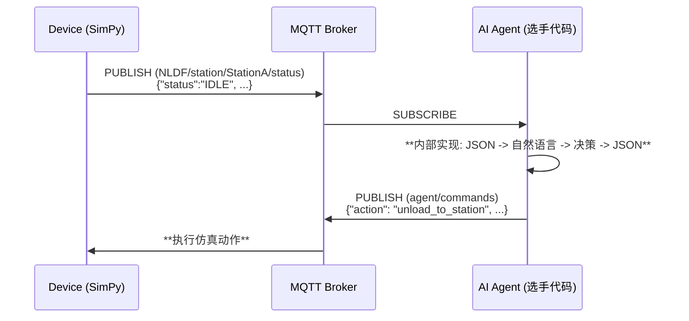

# SUPCON NLDF (Natual Language Driven Factory) Simulator

## Quick Start

### 1. Environment Setup

Download [uv](https://docs.astral.sh/uv/getting-started/installation/)

```bash
curl -LsSf https://astral.sh/uv/install.sh | sh
```

Clone project

```bash
git clone https://github.com/SUPCON-AdventureX/25-SUPCON-AdventureX-Hackthon.git
cd 25-SUPCON-AdventureX-Hackthon
uv sync
```

### 2. Run Simulation

设置环境变量TOPIC_ROOT来分隔不同选手，默认值为`NLDF_DEFAULT`

- add `--menu` arg to enable interactive input thread for test only
- add `--no-mqtt` arg to disable mqtt communication for debug offline

```bash
uv run run_multi_line_simulation.py (--menu) (--no-mqtt)
```

## Background

语言是新的协议BALABALA；Agent成了每个领域绕不开的革命火种，在工业领域也是一样，我们作为一家工业领域的国内龙头企业，也不断的在尝试将最新的agent技术融入到正常的工业厂房的流程中。随着ai agent的发展，我们进一步畅想，能否有个agent系统可以人类一样用自然语言进行决策？我们简单搭建了一个可操控的模拟工厂，由你来大显身手。

## 场景解释

工厂内部包含3条产线，一个原料仓库以及一个最终产品仓库，3条产线配置有一样的A，B，C工站以及一个质检站，AB，BC，CQ三条中间连接的自动传送带和AGV_1，AGV_2两个AGV。选手需要对3条产线的一共6个AGV进行操作（包括移动，装货卸货等），选手需要在有限的时间内操作agv协调生产，同时应对随机故障，获得尽可能高的KPI得分。（KPI 定义见下文）

为了简单起见，每个AGV的可移动路径点都使用P1-P10来表示，他们表示当前AGV路径上的相对可停顿点，如果希望AGV1或2前往某点例如原料仓库，都需要移动到P0点。AGV路径互不干扰，不考虑碰撞等因素，路径上的点ID如图。


| point_id | device_id | 备注 |
| :--- | :--- | :--- |
| P0 | RawMaterial | 原料仓库 |
| P1 | StationA | 工站A |
| P2 | Conveyor_AB | 传送带AB |
| P3 | StationB | 工站B |
| P4 | Conveyor_BC | 传送带BC |
| P5 | StationC | 工站C |
| P6 | Conveyor_CQ | 传送带CQ |
| P7 | QualityCheck | 质检站 |
| P8 | QualityCheck | 质检站 |
| P9 | Warehouse | 成品仓库 |

## 游戏机制

游戏使用simpy实现离散工厂的仿真

1. Order Generactor: 游戏有一个全局的订单生成器，每个订单中可能有一个或多个产品等待加工，一旦生成对应待加工的product会在原料仓库中出现
2. 产品说明： 游戏定义P1，P2，P3三种产品，产品id:prod_1_XXXXXX中包含3部分prod,type数字和UUID，产品有自己对应的工艺流程：
- 产品 P1 / P2
```
RawMaterial → [AGV] → StationA → Conveyor_AB → StationB → Conveyor_BC → StationC → Conveyor_CQ → QualityCheck → [AGV] → Warehouse
```

- 产品 P3
```
RawMaterial → [AGV] → StationA → Conveyor_AB → StationB → Conveyor_BC → StationC → Conveyor_CQ[upper/lower buffer] → [AGV] → StationB → Conveyor_BC → StationC → Conveyor_CQ → QualityCheck → [AGV] → Warehousse
```
3. AGV动作操控时会消耗电量，在移动前检查如果当前电量不足以完成动作，AGV会自动返回充电站充电。
4. KPI 指标

| 类别 | 指标 | 计算公式 |
|:---|:---|:---|
| **生产效率** | 订单完成率 | `按时完成订单数 / 总订单数 × 100%` |
| | 生产周期效率 | `实际生产时间 / 理论生产时间`（含完成率权重） |
| | 设备利用率 | `设备工作时间 / 总时间 × 100%` |
| **质量成本** | 一次通过率 | `一次通过质检数 / 总产品数 × 100%` |
| | 生产成本 | `Σ(物料+能源+维修+报废成本)` |
| **AGV效率** | 充电策略 | `主动充电次数 / 总充电次数 × 100%` |
| | 能源效率 | `完成任务数 / 总充电时间` |
| | AGV利用率 | `运输时间 / (总时间-故障-充电) × 100%` |

5. 竞赛评分系统（100分制）

- **生产效率**（40分）：订单完成率 16分 + 周期效率 16分 + 设备利用率 8分
- **质量成本**（30分）：一次通过率 12分 + 成本控制 18分  
- **AGV效率**（30分）：充电策略 9分 + 能效比 12分 + 利用率 9分
 

## 3. 功能与架构

### 3.1 核心工作流：外部 JSON 接口，内部自然语言驱动

仿真环境与选手 Agent 之间通过结构化的 JSON 消息进行通信，我们要求选手在自己的 Agent 内部构建自然语言处理能力，形成 `JSON -> NL -> JSON` 的完整决策链路。



### 3.2 MQTT 通信层
---

#### Topic 架构 (`NLDF_DEFAULT` will be replaced by use environment variable `TOPIC_ROOT`)

| Topic | Agent权限 | 描述 | 消息格式 (Payload) |
| :--- | :--- | :--- | :--- |
| `NLDF_DEFAULT/{line_id}/station/{id}/status` | **Subscribe** | 订阅所有工站的状态 | JSON (结构化) |
| `NLDF_DEFAULT/{line_id}/agv/{id}/status`| **Subscribe** | 订阅所有AGV的状态 | JSON (结构化) |
| `NLDF_DEFAULT/{line_id}/conveyor/{id}/status`| **Subscribe** | 订阅所有传送带的状态 | JSON (结构化) |
| `NLDF_DEFAULT/{line_id}/warehouse/{id}/status`| **Subscribe** | 订阅所有仓库的状态 | JSON (结构化) |
| :--- | :--- | :--- | :--- |
| `NLDF_DEFAULT/{line_id}/alerts`| **Subscribe** | 订阅所有设备故障警报 | JSON (结构化) |
| `NLDF_DEFAULT/orders/status` | **Subscribe** | 接收新订单信息 | JSON (结构化) |
| `NLDF_DEFAULT/kpi/status` | **Subscribe** | 订阅KPI更新 | JSON (结构化) |
| `NLDF_DEFAULT/result/status` | **Subscribe** | 订阅结果更新 | JSON (结构化) |
| :--- | :--- | :--- | :--- |
| `NLDF_DEFAULT/command/{line_id}`| **Publish**| 发布选手Agent生成的结构化指令 | JSON (结构见下文) |
| `NLDF_DEFAULT/response/{line_id}`| **Subscribe** | 接收选手Agent的响应 | JSON (结构见下文) |
---

选手发往 `agent/commands` 的消息**必须**是以下格式的 JSON 字符串：

```json
{
  "command_id": "str (可选字段，用于记录决策过程)",
  "action": "str (必须是支持的动作之一)",
  "target": "str (动作的目标设备ID，可选)",
  "params": {
    "key1": "value1", ...
  }
}
```

 支持的指令 `action` 和所需 `params`

| Action   | 描述                          | Target | `params` 示例                       |
| :------- | :---------------------------- | :----- | :---------------------------------- |
| `move`   | 命令 AGV 移动到指定路径点     | AGV ID | `{"target_point": "P9"}`          |
| `charge` | 命令 AGV 主动充电             | AGV ID | `{"target_level": 80.0}`(default: 80.0)                                |
| `unload` | 命令 AGV 卸载产品到指定工站   | AGV ID | `{}` |
| `load`   | 命令 AGV 从指定工站装载产品   | AGV ID | `{"product_id": "Prod_1_XXXXXXX"}`(only can be used in RawMaterial, else will be ignored) |
---
